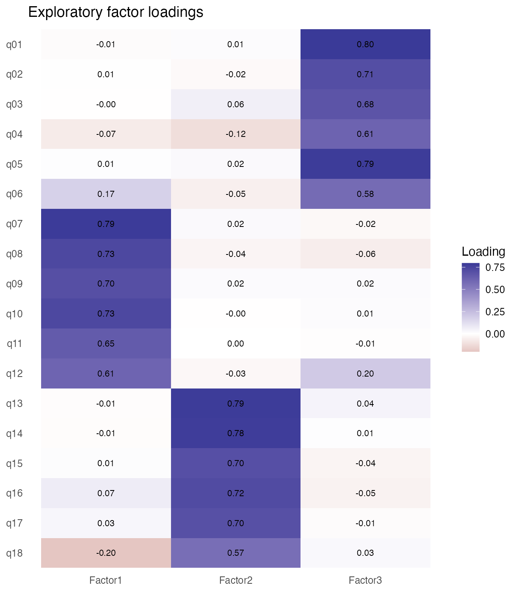
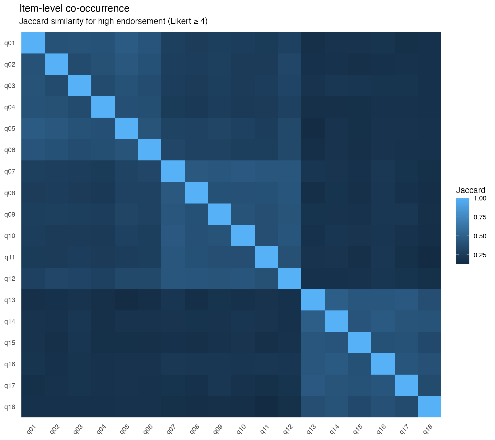
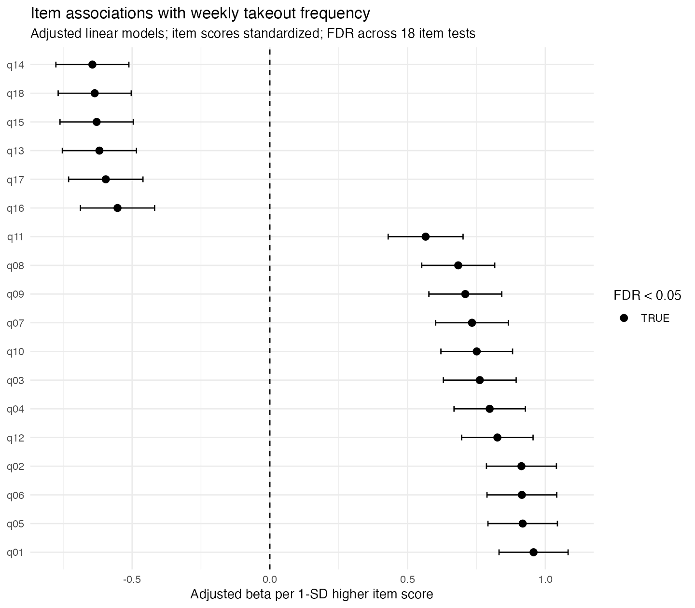
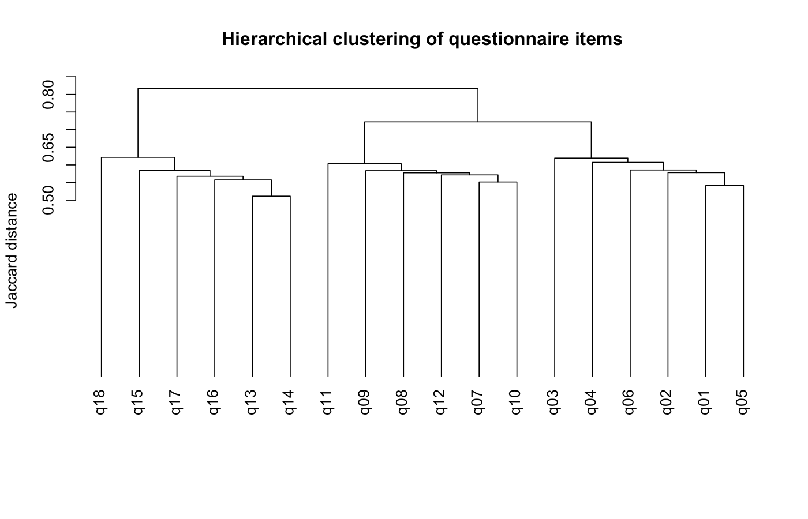

# Survey & Psychometrics Analysis Demo

Reproducible analysis of synthetic questionnaire data using psychometric and exploratory statistical methods in R.

This project demonstrates a workflow for survey and behavioral data analysis, with emphasis on response-quality assessment, exploratory factor structure, item-level co-occurrence, clustering, and multiple-testing control.

## Methods

- Synthetic 5-point Likert questionnaire data with a known latent structure
- Response-quality and missingness checks
- Item-level descriptive statistics
- Corrected item-total correlations
- Polychoric correlations
- KMO and Bartlett tests
- Parallel analysis
- Exploratory factor analysis with oblimin rotation
- Internal-consistency assessment
- Factor-composite construction
- Item-level co-occurrence using Jaccard similarity
- Hierarchical clustering
- Multivariable item-outcome association models
- Benjamini-Hochberg false-discovery-rate adjustment
- Reproducible figures and session information

## Repository Structure

```text
data/       synthetic and cleaned questionnaire datasets
scripts/    numbered R analysis scripts
output/     tables, diagnostics, and figures
run_all.R   runs the complete workflow
```

## Quick Start

Install the required packages once:

```r
install.packages(c(
  "MASS", "psych", "GPArotation",
  "dplyr", "tidyr", "ggplot2", "broom", "readr"
))
```

Then run the complete workflow from the project root:

```r
source("run_all.R")
```

The workflow will regenerate the synthetic dataset and all analysis outputs.

## Workflow

1. Generate an 18-item synthetic Likert questionnaire with three correlated latent dimensions.
2. Identify low-quality responses using missingness, straightlining, completion time, and an attention check.
3. Produce item-level descriptive and discrimination statistics.
4. Evaluate factorability and estimate exploratory factor structure.
5. Construct factor composites and assess internal consistency.
6. Examine high-endorsement co-occurrence and hierarchical item clustering.
7. Test item and factor associations with an external behavioral outcome and apply FDR correction.
8. Generate publication-style figures and save session information.

## Example Outputs

### Exploratory Factor Loadings



### Item Co-occurrence



### FDR-Adjusted Item Associations



### Hierarchical Clustering



## Reproducibility

The complete analysis is generated from synthetic data by running:

```r
source("run_all.R")
```

R session information is saved to `output/session_info.txt`.

## Data Privacy

All data in this repository are synthetic. No real participant, patient, hospital, survey, or unpublished research-project data are included.
